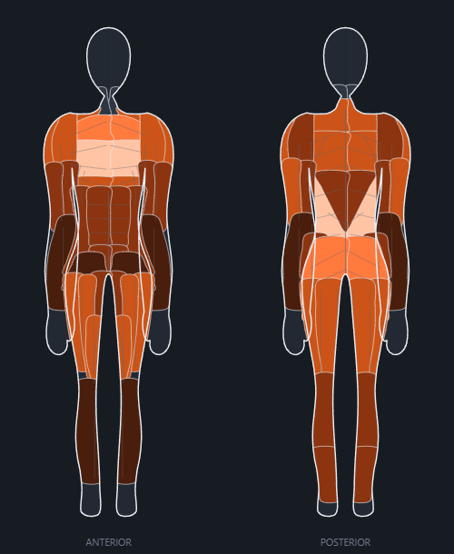

# AI-Gym

**Version 0.7.0**

A mobile-first, offline-first training log in plain HTML, CSS and JavaScript. No build step, no framework, no npm install, no CDN — open it and it works.

- **Built for the phone**: bottom tab bar, bottom-sheet dialogs, 40px+ touch targets, one column by default, and charts that measure their container instead of being scaled to fit
- **468 built-in exercises**, each with a weighted muscle split, an equipment tag and its own world record — including wide/close grip variants across the bar movements
- **Anatomical heat figures** (anterior + posterior) on every exercise, workout, session and report, scored against **what each muscle actually needs** rather than against whichever muscle you hit hardest
- **Scored against the published dose-response research** rather than gym folklore: a reps-to-failure curve fitted to 952 studies' worth of tests instead of a 1985 formula, proximity to failure read off the log rather than typed in, and a per-session ceiling that makes the case for training a muscle twice a week instead of asserting it
- **A Volume tab** showing weekly hard sets and how they were spread, per muscle, with the sets a single session was too full to use called out by name — in the workout builder, before you run it
- **Workout builder** with sets, reps, load, per-set and per-exercise rest (all in seconds, and it says so), **drag reordering that works with a thumb**, and smart push/pull/legs grouping, in a **muscle-group order you set** — with templates that apply to the exact splits you run
- **Session runner** with a rest timer and live volume
- **Progression reports** with least-squares trend lines and a 60-day forecast band, **training load filtered by the kind of session it was**, plus a **ranking chart** tracking your points and your friends' against the tier thresholds
- **Growth forecasting that bends**, projecting each lift against the world-record ceiling for your bodyweight instead of extrapolating a straight line into a number nobody has lifted
- **Eight ranks scored against world records** for your bodyweight — your rank is the average across everything you train, and Diamond is 99%
- **Update check on every open**, against GitHub releases, offering the update by itself — with a manual check in the Control Panel as well, and an update that never costs you work in progress
- **End-to-end encryption** of everything written to the cloud — AES-GCM with a key that never leaves your devices in the clear
- **Invite codes** for adding friends: generate, share, redeem — redeeming is the acceptance
- **Friends and head-to-head comparison** through a shared hub
- **Three storage tiers**: IndexedDB always, your own Supabase optionally, a shared hub only for friends
- **Light / dark / AMOLED**, eight colour schemes that also drive the heat gradient, and twelve page backgrounds (six static, six animated — including a sci-fi skyline, a cyberpunk board and a receding hologrid) built from that same palette — with every panel going translucent so the background reads through the whole page, and a **motion budget** that keeps them smooth on an old phone

---

## Running it

```bash
node tools/serve.js
```

Then open <http://localhost:4173>.

You can also open `index.html` straight from the file system — everything is classic scripts and relative paths, so it loads. Two caveats when you do: some browsers block IndexedDB on `file://` (the app detects this and silently falls back to `localStorage`), and the SQL panel in the Control Panel can't `fetch` the schema file, so it tells you to open `sql/user-schema.sql` by hand instead. Running the server avoids both.

Nothing else is required. There is no account, no network call and no cloud dependency in the default path.

---

## Layout

```
index.html            loads everything in dependency order
css/
  theme.css           design tokens, 3 modes, 8 schemes, the heat ramp
  app.css             reset, app shell, component kit
  backgrounds.css     12 page backgrounds, all derived from the scheme palette
js/
  data/muscles.js     38-region muscle taxonomy — the shared vocabulary
  data/exercises.js   GENERATED — do not hand edit
  util.js             DOM factory, formatting, icons, toasts, modals
  db.js               IndexedDB with a localStorage fallback
  anatomy.js          the front/back figures
  charts.js           SVG line/bar/spark charts + linear regression
  science.js          the training research: reps~%1RM, RIR, volume curves
  ranks.js            1RM estimation, strength scoring, the 8-tier ladder
  store.js            domain model, CRUD, derived stats, events
  supabase.js         dependency-free Supabase REST + auth client
  sync.js             local ⇄ personal project ⇄ hub orchestration
  components.js       shared UI (pickers, editors, rank card, heat panel)
  crypto.js           AES-GCM sealing, PBKDF2 key wrapping, key escrow
  update.js           version check + resume-after-reload snapshots
  pages/*.js          the five pages
  app.js              shell, router, theme
sql/
  user-schema.sql     run in YOUR project
  hub-schema.sql      run once in the shared project
tools/
  serve.js            zero-dependency static server
  gen-exercises.js    regenerates js/data/exercises.js
version.json          the deployed version, used by the update check
docs/SETUP.md         the full Supabase walkthrough
```

Dependencies run one way: `pages → components → store → db`. Nothing above `store.js` knows how data is persisted, and nothing above `sync.js` knows the cloud exists.

---

## The exercise library

`js/data/exercises.js` is generated. Edit `tools/gen-exercises.js` and re-run:

```bash
node tools/gen-exercises.js
```

The generator expresses the library as base movements plus variant matrices (equipment × angle × grip × stance). A bench press is one muscle map that incline/decline/dumbbell/smith variants *shift* rather than restate, which is what keeps 468 movements internally consistent instead of drifting apart the way a hand-typed list does. It refuses to write if any exercise references a muscle id that is not in the taxonomy.

Users can add, edit and delete exercises freely; those live in IndexedDB and override the built-ins by id.

---

## How ranks work

The yardstick is the **world record for your bodyweight**, and your rank is the **average** across every movement you train. One weak accessory drags the number down without capping you outright.

| Rank | Needs, averaged across everything you train |
|---|---|
| Wood | — |
| Stone | 30% of a world record |
| Bronze | 42% |
| Iron | 54% |
| Silver | 65% |
| Gold | 78% |
| Platinum | 90% — close to complete |
| **Diamond** | **99% — a world record in all of them** |

Records are stored as a 1RM-to-bodyweight ratio at an 80 kg reference and re-scaled allometrically (strength ≈ mass^⅔), because absolute strength tracks cross-sectional area. A 60 kg lifter is therefore held to a higher bodyweight multiple than a 120 kg lifter for the same rank. 1RM comes from the reps-to-failure curve in `js/science.js`, not from Epley or Brzycki — see *The research this is built on*.

The ladder is steep at the top and gentler at the bottom. For an 80 kg lifter:

| Lifter | Bench / Squat / Deadlift / Curl | Average | Rank |
|---|---|---|---|
| Beginner | 40 / 60 / — / 10 | 18% | Wood |
| Intermediate | 100 / 140 / 180 / 20 | 45% | Bronze |
| Advanced | 150 / 210 / 260 / 45 | 71% | Silver |
| Near-elite | 200 / 290 / 330 / 75 | 98% | Gold* |

\* capped — see below.

**The top two ranks need breadth.** Platinum and Diamond additionally require at least **8 scored movements**. Without that, a single heavy deadlift and nothing else would average 99% and hand out Diamond, making the hardest tier the easiest one to game. The near-elite lifter above trains only four movements, so they are held at Gold until they log more.

### Per-exercise records

Every exercise carries its own world record, entered when you create it and pre-filled from the movement pattern. It is stored alongside the bodyweight it applies to, so it re-scales allometrically exactly like the built-in ratios do — otherwise gaining or losing weight would silently change how close to a record you appear to be.

The pattern table is only a fallback. "The vertical-pull record" is a coarse stand-in for a hundred different movements, and the person doing the lift knows their sport better than a lookup table does, so a record you enter always wins.

Two things sharpen that fallback. **Equipment scales the ceiling**: a Smith bar runs a fixed path and is usually counterweighted, and a machine removes the balance problem entirely, so both allow more load than the free-weight movement the pattern ratio is quoted for. And where one pattern has to cover movements of very different heaviness — `shoulder-isolation` serves both a lateral raise and an upright row — the outliers carry an explicit record in `tools/gen-exercises.js` rather than being averaged into nonsense.

Outside the contested lifts, treat these as **best-effort elite ceilings, not ratified records**: no federation contests a cable upright row or a pec deck, so there is no official number to look up. If you know a movement better, override it — yours wins.

**Not everything is rank-bearing.** A movement counts toward the average only if it carries a recorded external load, or is a bodyweight movement whose whole point is maximal effort (pull-up, dip, push-up, pistol). A plank is scored and shown but cannot set your rank, since holding a position is not a one-rep max and crediting it with full bodyweight would let it outscore a real lift.

Standards are held per movement *pattern*, not per exercise, so a lat pulldown is measured against the vertical-pull record rather than against a pulldown-specific one. That is a deliberate approximation — though a record you enter on any individual exercise overrides it.

---

## What the heat figures mean

100% on a figure is **the training that muscle needs to get stronger**, for a
person of your bodyweight. It is not "the most-worked muscle here".

That distinction is the whole point. Heat used to be normalised so the
hardest-worked muscle read 100%, which sounds useful and is not, because the
scale moved underneath you. Train nothing but calves and the calves read 100%.
Add one heavy squat day and the same calf work drops to 30% — the calves did not
change, the comparison did. Nothing could be read across two figures, because no
two figures were ever on the same scale.

The unit is the **hard set**, which is how training volume is actually
prescribed. Ten to twenty hard sets per muscle per week is the productive range;
twelve is the figure the app measures against.

**The answer is a weekly rate.** Divide the work by the length of the selected
range and a fortnight of hard training viewed over 90 days is divided by
thirteen weeks — so a genuinely hard chest week reports 3% and the figure looks
like nothing happened. The range is a filter on what to look at, not a claim
about how long you were training, so the divisor is the span the sessions
actually cover, rounded up to whole weeks. Four weekly sessions sit three weeks
apart end to end but represent four weeks of training, which is why it rounds up
rather than dividing by the bare span. The reading then means "in a week you
train, this muscle gets X% of what it needs", and it stays put whether you are
looking at a month or a year.

Three things decide what a set is worth, and all three now come from the
dose-response literature rather than from a rule of thumb:

- **How close to failure it was.** The part a volume count cannot see, and the
  part the growth research is clearest about: strength gains are much the same
  whether a set ends at failure or several reps short, and growth is not — it
  rises as sets end closer to failure and falls away past about four or five
  reps in reserve. **Nothing has to be typed in.** The reps-to-failure curve
  says how many reps the load allowed; the log says how many were done; the
  difference is the reps left in reserve. Falling short of the reps a plan asked
  for still overrides the estimate, because a set that could not be finished is
  not an estimate of failure — it is failure.
- **How long the set was.** Only at the ends. A set of twenty taken near failure
  grows a muscle about as well as a set of eight, so the old three-to-fifteen
  band — a strength heuristic wearing a growth hat — is gone. Singles and
  thirty-rep sets still count for less.
- **Where it sat in the session.** The eleventh set for one muscle in one
  session is where another set stops buying anything detectable, so late sets
  are discounted toward a floor. **This is the whole frequency model**, and the
  indirection is deliberate — see below.

A set is judged against **your own** best on that movement as at the day you did
it, not against a world record and not against your best ever. Against a record,
because "near failure" is a statement about this person on this movement. As at
that day, because judging a set from two years ago against today's best reads
the whole of someone's early training as easy.

Shares are renormalised against each exercise's own prime mover, so a set of
bench press is one hard set for the chest and a fraction of one for the triceps.
Taken as raw shares of a hundred, a set would only ever be worth about a third of
a hard set to anything, and no amount of realistic training would reach the
requirement.

Two consequences worth knowing. Muscle-group figures are **averaged**, not
summed — four chest regions at 80% each is a chest trained to 80%, not to 320% —
and that average is weighted by the values themselves, so a minor accessory like
the serratus cannot drag a well-pressed chest down to a quarter of what its pecs
are reporting. And an exercise's own figure in the library still scales to
itself, because there the numbers are a *composition* (a muscle split adding to
100) rather than a dose, and the largest share genuinely is the reference.

---

## How often should you train a muscle?

The honest answer is that **frequency is not a requirement in its own right**,
and the app is built to say so rather than to hand out a number.

With weekly volume held equal, training a muscle more often does not clearly
grow it faster. The reason twice a week keeps beating once in the trials is
visible one level down: a session saturates. Past roughly eleven sets for one
muscle in one day, another set no longer produces a difference large enough to
detect, so a week's volume crammed into one session is a week's volume with the
tail cut off it.

So there is no frequency target anywhere in the app. What there is instead:

- Sets accumulate **within a session**, and the credit per set falls away past
  six, reaching a floor around eleven. A new session starts everything back at
  full credit — which is exactly why spreading the work pays.
- The **workout builder** names the muscles a plan stacks past that point while
  the plan is still being written, with how many sets it expects to waste.
- The Report's **Volume** tab shows, per muscle, credited sets a week, sets
  actually performed, days a week, and sets per session — so the gap between
  the first two has a cause you can see.

Twelve sets a muscle a week is the working target, and it is a **setting**,
because the volume research does not find a ceiling: size keeps rising with
weekly sets, with diminishing returns, as far out as the data goes.

---

## The research this is built on

Everything above lives in one file, `js/science.js`, with the numbers written
down next to the code that uses them. Four questions, four answers:

**How many reps can you do at a given fraction of your 1RM?**
Nuzzo, Pinto, Nosaka & Steele (2024), *Maximal Number of Repetitions at
Percentages of the One Repetition Maximum*, Sports Medicine 54:303–321 — a
meta-regression of 952 reps-to-failure tests by 7,289 people across 269 studies.
Two findings, both of which contradicted what the app used to do:

- **People do more reps than the classic tables say** — about 8 at 80% of a max,
  15 at 70%, 5 at 90%. Read backwards, Epley and Brzycki therefore turn a long
  set into a 1RM nobody could lift. A set of thirty used to be scored here at
  3.6× the bar. It is closer to 1.85×.
- **The curve is not the same for every movement.** A leg press allows 13.1 reps
  at 80% of a max where a bench press allows 8.8. The app carries the paper's
  two tables, and picks between them by movement pattern and implement.

The spread between people is large enough to show rather than hide — an SD of
2.5 reps at 80% and 4.4 at 60% — so the load-and-reps table on every exercise
prints the range, not just the number.

**How close to failure does a set have to be?**
Robinson, Pelland, Remmert, Refalo, Jukic, Steele & Zourdos (2024), *Exploring
the Dose-Response Relationship Between Estimated Resistance Training Proximity
to Failure, Strength Gain, and Muscle Hypertrophy*, Sports Medicine
54:2209–2231, with Refalo et al. (2023) behind it. Strength is flat across a
wide band of reps-in-reserve; growth is not.

**How much volume, and how much of it in one session?**
Pelland, Remmert, Robinson, Hinson & Zourdos (2025), *The Resistance Training
Dose Response*, Sports Medicine — 67 studies, 2,058 participants; and Remmert et
al. (2025), *Is There Too Much of a Good Thing?*, which asks the same question
per session and puts the point of undetectable superiority at about eleven
fractional sets.

**Does load matter?**
Schoenfeld, Grgic & Krieger (2017), *Strength and Hypertrophy Adaptations
Between Low- vs. High-Load Resistance Training*, JSCR 31:3508–3523. Taken near
failure, growth is much the same anywhere above roughly 30% of a max — which is
why the rep-range penalty now only bites at the ends.

**And frequency?**
Schoenfeld, Grgic & Krieger (2019), *How many times per week should a muscle be
trained to maximize muscle hypertrophy?*, J Sports Sci 37:1286–1295, plus the
frequency arm of the Pelland dose-response above. See the section before this
one for what the app does with the answer.

**What changed when this went in.** Estimated 1RMs from long sets dropped, most
of all on machine leg work and on anything logged above fifteen reps, so records
and ranks moved with them. Nothing was lost — the same sets are scored, against
a better curve.

---

## Forecasting, and why the line bends

The Report's **Forecast** tab answers "where will this lift be in a year". A least-squares line answers it by assuming the last three months repeat forever, which is fine over sixty days and dishonest over three hundred and sixty-five: progress against a ceiling slows as the gap to it closes, and the training that adds 10 kg to a 60 kg bench adds a fraction of that to a 160 kg one.

So the projection is the standard bounded-growth curve

```
y(t) = C − (C − y₀)·e^(−k·t)
```

fitted by the same least-squares machinery, because taking logs of the **remaining gap** linearises it: `ln(C − y) = ln(C − y₀) − k·t`. One substitution and the decay rate falls out of the slope. `App.Charts.saturating()` in [js/charts.js](js/charts.js) is the whole of it, and it fits against time *since the first point* — epoch milliseconds put the sums of squares near the edge of what a double holds apart.

**The ceiling C is the exercise's own world record**, re-scaled allometrically to your bodyweight — the same standard the ranks are measured against, so the forecast and the rank cannot tell different stories. Set a truer record on the exercise and the curve follows it. A ceiling at or below what has already been lifted leaves no gap to fit, so it is lifted clear of the best logged effort; someone who has beaten the estimate simply has a higher ceiling than the estimate knew.

Two things are deliberately shown rather than smoothed away. The **straight-line projection is drawn alongside** the curve: the gap between them at twelve months *is* the diminishing return, and quietly replacing one number with a smaller one teaches nothing. And a lift that is flat or going backwards gets **no projection at all** — a curve fitted to a decline would only project the decline forwards, which is a worse guess than no guess.

The decay rate is reported as a **half-life**: "half of the remaining gap every 11.8 months" is a statement about training. `k = 5.9e-9` is not.

---

## Layout rules

The app is designed for a phone first and widens from there. Three rules do most of the work:

- **Stack by default, go horizontal only when it fits.** Multi-column grids collapse to one column below 860px. The exceptions are compact stat tiles, which stay two-up because a row each just makes cards taller.
- **Nothing is sized to a fixed pixel width in JS.** Layout lives in CSS so it can respond; inline `gridTemplateColumns` was what squeezed the anatomy figures to 28px wide before this was fixed.
- **Charts measure, they never scale.** Each chart reads its container width and builds its viewBox at that exact pixel size, so one SVG unit is always one CSS pixel and a `ResizeObserver` redraws on rotation. Scaling a fixed-width viewBox to fit compressed the whole plot — tick labels included — by about 2.5x on a phone.

Breakpoints: 1100px (sidebar layout loosens), 860px (sidebar becomes a bottom tab bar), 760px (figure panels stack), 560px (denser list rows), 344px (tiles go single column). A `(hover: none)` block makes row actions permanent and grows hit areas, since a phone never fires hover.

### The plan is a starting point, the log is the memory

Starting a workout opens it with **what you actually did last time** — the same
weights, the same reps, and the same number of sets — falling back to the plan
only for a movement that has never been logged. A session never rewrites the
plan's sets and reps, and never needs to, because the log already remembers.
Previously the set *count* came from the plan even though the weights came from
the log, so a fourth set added last week quietly disappeared this week while its
weights were still being carried forward.

One thing does still belong to the plan: **which movements are in it**. Adding or
dropping an exercise is a change to the workout itself rather than to one day of
it, so finishing a session whose movement list differs from the plan asks whether
to write that change back — naming what would be added and what would be removed.
It only asks when something actually differs; a dialog that appears after every
session to report that nothing changed is a tap and nothing else.

### Dragging to reorder

Both the workout list and the exercises inside a workout reorder by dragging. This used to be HTML5 drag-and-drop, which fires **nothing at all on a phone** — `dragstart` requires a mouse — so in a phone-first app the feature was invisible to almost everyone it was for, and the move-up / move-down buttons were the only route that actually worked.

`U.dragList()` is pointer-driven instead, and the gesture starts from a **grip**, never from the item body. That is the point: a grip can declare `touch-action: none`, which is what lets the drag win against the page scroll, and an item that did the same could never be scrolled past. Positions are measured once at the start and every item that has to move is moved with a `transform`, so nothing is re-laid-out mid-gesture; the view creeps when the finger reaches an edge, and the measurements travel with it so the item stays under the finger.

Order is resolved through the **ids in the DOM**, not through the two indices the drag reports. Under "group by muscle group" the blocks on screen are in a different order from the plan, so index 3 on screen is not item 3 in the workout; reading the ids back in their new order works either way. Workout order persists as an integer per workout, and the whole list is renumbered from zero on every change rather than only the rows that moved — a partial renumber leaves stale or absent numbers behind and the next reorder has to reason about two orderings at once.

The up / down buttons stay. They are the keyboard and accessibility route to the same result, and they are what you want for a single nudge.

### The muscle figures are an input, not just a picture

Tapping a region names it and pins a readout. **Holding one assigns it** — in the exercise editor that adds the muscle to the split, so a movement can be built by pointing at the body instead of hunting for "Vastus lateralis" in a dropdown, which is also the only one of the two that works one-handed. It is a hold rather than a second tap because a plain tap already means "tell me about this one", and a gesture that reads or writes depending on how fast you were is a trap. Movement cancels it; a finger that has started to scroll is not making a selection.

**Selection is deliberately outside the colour scheme.** Every other colour in the app derives from the scheme, which is exactly what a selection must not: against Ice or Flux an accent-coloured highlight lands a few points from the heat ramp it is drawn on top of, and the region you just tapped becomes the hardest one on the figure to find. A near-black block ringed in white — inverted for the dark modes — reads the same against every scheme and every heat colour there is. `paint-order: stroke` keeps the ring outside the shape so a small belly is not swallowed by its own outline.

Figures are also **repainted rather than rebuilt**. The editor used to re-render both of them from scratch on every keystroke in a percentage field — about forty kilobytes of fresh SVG parsed per character typed — when nothing but the fills had changed. `App.Anatomy.render()` now recognises a figure it can update in place, which is a couple of attribute writes per region, and reorders nodes only when the *set* of loaded muscles actually changes.

### Dialogs open on the first frame

`U.modal()` takes an `onShown(body, close)` that runs after the browser has painted the open dialog. Everything a `body` builder does runs *before* the dialog is in the document, so on a phone the gap between tapping "New exercise" and seeing anything at all was the full cost of building the form — two anatomy figures included. The dialog arrived late and then animated, which reads as a stall rather than a transition.

Now the cheap chrome goes up immediately and the expensive content fills in a frame later; the synchronous half of opening the exercise editor is about 2 ms. Two `requestAnimationFrame`s, not one — the first is the frame the dialog paints in, and doing heavy work there would stall the very first frame of the entry animation, which is the jank being avoided. Deferred figures leave a placeholder built from the same `.anat-svg` class, so it is exactly the size of what replaces it at every breakpoint and nothing below it moves on the swap.

The scrim also lost its `backdrop-filter`. A viewport-wide blur was being asked for at the worst possible moment — while the dialog animated, over whatever the page underneath was still painting — and removing it is most of why the sheet now opens without a stall.

### Backgrounds and translucent surfaces

Backgrounds are six absolutely-positioned layers in a fixed host, each built from the scheme palette. A background claims only the layers it needs; the rest paint nothing and are never promoted. When one is selected, every container that would otherwise be an opaque slab — cards, modals, tiles, table headers, the topbar and nav — goes translucent so the background reads through the whole page. Selecting **None** restores fully opaque surfaces.

**Performance is the design constraint.** An earlier version ran two viewport-sized layers under `filter: blur(70px)` while animating them, and put `backdrop-filter` on every card. Those are two of the most expensive things a mobile browser can be asked to do — a large blur re-rasterises as the layer moves, and each backdrop-filter forces a compositing layer that re-reads what is behind it on every paint. The current version has **no `filter` or `backdrop-filter` in the running app at all**: softness comes from wide radial-gradient falloffs, which cost nothing, and only `transform`/`opacity` are animated so frames never leave the compositor. `will-change` and layer activation are both opt-in per background, so nothing is promoted that does not move.

Two knobs in [css/backgrounds.css](css/backgrounds.css), both mode-aware: `--bg-alpha` (how strong the background reads) and `--surface-alpha` (how transparent panels are). Dark text on a washed-out light panel loses contrast much faster than light text on a dark one, so the values differ per mode, and dark modes also lift `--text-2`/`--text-3` a step while a background is active — a bold background washes a dark panel *lighter*, which eats light-on-dark contrast. Checked across all 144 mode × scheme × palette-stop combinations: worst-case body text 6.2:1, worst muted text 3.2:1, zero WCAG AA failures.

**The motion budget.** An animated background is pure fill rate — every frame repaints a viewport-sized layer per moving element — and six of them at once is fine on a desktop and is not fine on a five-year-old phone. So how many layers are *allowed to move* is a setting (`Background motion` in the Control Panel), resolved onto `data-bgmotion`. **Automatic** reads `deviceMemory` and `hardwareConcurrency`, which are crude but honest in the direction that matters, and treats a browser that answers neither as old enough to be careful with. **Light** keeps one or two layers moving per background and slows them; **Still** freezes them. Layers are stilled, never hidden — a background that looks *different* on an old phone would be a worse outcome than one that moves less. Animations also pause on `visibilitychange`, because a web-to-app shell is not a tab and does not reliably get the throttling a tab would.

**Building a city out of gradients.** The first Skyline and Neon City used three
`repeating-linear-gradient`s per band, which can only ever produce one rectangle
repeated at one height — so the city read as three ruled rows of identical
blocks. Every tower is now its own background image with its own width, height,
position and darkness, generated once from a fixed seed so the skyline is
irregular but stable, and each tower is darker at street level than at the roof.
Windows are a separate layer **masked by the same tower shapes**, so light can
only appear on a building. A window is a rectangle, not a dot: a `conic-gradient`
fired from a point inside its tile covers everything up and to the right of that
origin, and inside a rectangular tile that region *is* a rectangle. Under each
pane sits a soft radial — the light it spills onto the wall around it. Positions are
percentages, so the city redistributes across a phone and a desktop instead of
running out of buildings on a wide screen. Orbs went the same way — thirty small
bodies at varied sizes and brightnesses read as orbs; three large ones read as a
gradient — grouped onto three layers so the field still costs three animations
rather than thirty.

**A phone is not a small desktop.** Hologrid's lane fan and rung spacing are both
absolute — an angle and a pixel period — so a narrow, tall viewport sees a slice
of the same fan rather than a scaled version of it, which on a phone meant a
handful of near-vertical lanes and three or four rungs. Narrow screens get a
tighter fan, a lower horizon, a shorter rung period, and their own keyframe so
the loop still travels exactly one period.

Two gotchas worth recording. `radial-gradient(closest-side …)` anchored at an edge (`at 50% 0%`) collapses to a zero radius and paints nothing, so every gradient here uses explicit size pairs. And **`perspective()` + `rotateX()` on a viewport-sized layer is not affordable**: the first Hologrid built its receding grid that way and froze the renderer outright on a desktop, because a 64° tilt throws the near edge of the layer far enough towards the camera that the raster area explodes. The perspective is now *drawn* — a `repeating-conic-gradient` fired from the vanishing point gives converging lanes for one static paint, and the rungs are a uniform grid translating by exactly one period under a fade-to-horizon mask. The eye reads perspective; the compositor reads two flat layers.

### Updating

**The check runs by itself, every time the app is opened.** It asks GitHub releases for a newer version — falling back to the deployed `version.json`, since a build can be live before anyone tags a release — and puts the update dialog up on its own. The button in the Control Panel is still there, for when you want to ask rather than be told.

"Every time the app is opened" is doing real work in that sentence. It used to mean "at most four times a day", which is not the same thing: open the app a second time that morning and it did not look at all, so a release published in between sat unnoticed and the automatic check looked broken. What remains of the interval is a 45-second debounce, and only a check that actually reached the network resets it — an app opened with no signal used to go quiet for the rest of the window, including once the signal came back.

It also means more than a reload. In a web-to-app wrapper the page is never torn down, so a boot-only check runs once on the first launch and then never again for as long as the wrapper lives. The check is therefore bound to **returning to the foreground** after five minutes away and to **regaining a network**, as well as to boot. It will not open a second dialog over a first, so a resume during the first-run walkthrough waits its turn.

**"Later" now means later.** It was stored as a bare version string and suppressed that version for good — the one button in the dialog that quietly turned the automatic check off. It is stored with a timestamp and lasts a day, or until something newer than it appears.

A boot that fails outright still runs the check, and the error card carries its own button. A version that will not start is the one case where an update is most likely to be the fix.

**An update never costs you work in progress.** Pages register a snapshot provider; the snapshot is written to IndexedDB on every edit and on `pagehide`/`visibilitychange`, so an OS-initiated kill is survivable too, not just our own reload. Take an update mid-workout and you come back to the same sets ticked, the same weights entered, and the elapsed clock still counting from the original start rather than restarting at zero.

**Getting the new code is the hard part, not the reload.** The document reloads against a cache-busting query, but the app *is* the twenty script and stylesheet files `index.html` references by unchanging relative paths. Busting the document alone fetched a fresh page and then filled it with cached JavaScript, so the app came back running the version it had been asked to leave — appearing to update only once those cache entries aged out on their own, several attempts later. Every same-origin asset is now pulled through `fetch(url, {cache: 'reload'})` first, which skips the cache on the way out and writes the fresh response into it, so the reload that follows parses the new files.

If an update still does not take, the app says so on the next boot — naming both versions and pointing at a hard refresh — instead of quietly carrying on as though it had worked.

### Keeping the projects awake

A free Supabase project is paused after a stretch with nothing touching it, so
the app makes **one real write to each project per calendar day, per device**.
Nobody has to press anything; the button in Diagnostics only exists to run it
early and show what happened.

Hanging that off start-up alone left three ordinary ways to miss a day, and all
three are now covered:

- **Opened offline.** Start-up returns immediately with no network, so the
  day's write never happened — not even once the signal came back ten minutes
  later. It now also runs on the `online` event.
- **Never reloaded.** In a web-to-app wrapper the page stays in memory for days,
  so start-up runs once on the first launch and a week of daily use after that
  is a week of never asking again. It now also runs on returning to the
  foreground.
- **Left open over midnight.** The guard is per calendar day, so a page already
  running when the day turned over had already done "today". A slow timer sits
  behind the other two for exactly that case.

Calling it this often is free: the call returns immediately once the day is
done, which is what makes it safe. The hub write is guarded server-side too —
whichever user opens the app first that day performs it, and everyone else gets
`ran = false`.

### Encryption

Everything the app writes to a Supabase project is encrypted on your device first. One random AES-GCM-256 **data key** per account, generated locally and never transmitted in the clear. Each record gets a fresh IV, and GCM authenticates as well as encrypts, so tampering is detected rather than silently decrypted into nonsense.

To let a second device read your data, the key is **wrapped** with a key derived from your account password (PBKDF2-SHA256, 310k iterations, random salt) and the wrapped blob is stored in the hub. The hub therefore holds ciphertext it cannot read. Sign in on a new device, enter the password, and the key comes back — along with your project URL and keys, so the connection restores itself rather than asking you to paste anything.

Credentials stored in the hub are encrypted too. If yours were written by a build that predates this — or before the key had finished loading — the app notices on launch and re-publishes them sealed, so a plaintext key does not sit there indefinitely.

**What is not encrypted, deliberately.** The aggregate stats you publish for friends, and the promoted columns your own project indexes on (name, date, volume). The aggregates are the thing you are explicitly choosing to share, so encrypting them would break the feature they exist for; the promoted columns have to stay readable for the database to sort and filter. Treat those as visible to anyone holding your publishable key — the detail behind them is not.

**The trade-off worth knowing:** lose the account password and the encrypted data is unrecoverable. A password reset through Supabase auth does not help, because the old password was the only thing that could unwrap the key. This is what end-to-end actually means — there is no one who can let you back in.

### Project schema versions

The app declares the project schema version it needs and checks the connected project on launch. When they differ it offers a migration: automatic from v2 onward through `gym_migrate()`, which only ever adds columns; a guided copy-paste from v1, where that hook did not exist yet.

Uploads do not fail in the meantime. If a column the build expects is missing, the upload retries without it rather than rejecting the whole batch — those columns are informational, since encrypted rows are recognised by their payload shape rather than by a flag.

### Adding friends

Two routes. **By handle** sends a request the other person approves. **By invite code** goes the other way: you generate a single-use code, hand it over through any channel you like, and redeeming it completes the link in one step — holding the code *is* the consent, so there is no second approval to chase. Codes expire after 14 days and can be revoked.

**A handle is stored bare and shown with an @, always.** The hub's own format check is `^[a-z0-9_]{3,24}$`, so an `@` sent to it matches nobody and comes back as "no account with that handle". Half the app used to print `'@' + handle` and half printed the handle, and the search box accepted either — the same identifier in two spellings, neither of them authoritative. `U.handle()` decides what goes on screen and `U.bareHandle()` decides what goes to the hub, `App.Sync.requestFriend()` strips defensively so no future caller can reintroduce the dead end, and the search field draws the `@` as furniture beside the input so the value can never carry one.

Finding someone is a **search**, not a spelling test: matches appear as you type, **five of them, alphabetically**. The hub sorts by rank points, which is the wrong order for picking a known name out of a list. Each result says what it already is — friend, request sent, they asked you — instead of letting you send a request that was never going to land.

**Incoming requests get their own block at the top of the Friends card**, naming the sender with Accept in reach. They were previously a heading part-way down a list you had to already be scrolling, which is a poor place for the one thing on the page that is waiting on you.

### Running inside a web-to-app wrapper

The app is commonly wrapped as a native shell, where a normal link opens in the shell's own webview and traps you there. Every external link is therefore a `linkRow`: the full URL is shown and selectable, **Open** tries `_system`, then a `rel="external"` anchor click, then `window.open`, and **Copy link** is always there because none of those is guaranteed.

Copying is equally defensive. `U.copy()` tries the async Clipboard API, then `ClipboardItem`, then a contenteditable Range (which is what iOS webviews need — a readonly textarea will not take a selection), then `execCommand` on a textarea. If all four fail, `U.copyOrShow()` puts the text on screen pre-selected with a Share button, so there is always a route to it.

---

## Storage model

1. **IndexedDB** — authoritative for the device. Works offline, never expires, needs no account. If IndexedDB is unavailable the app transparently falls back to `localStorage`.
2. **Your own Supabase project** — optional full mirror. Adds backup, multi-device sync, and lets friends read you.
3. **The hub** — accounts, handles, friendships, and a cached stats roll-up. Never holds training data.

Writes are queued in an `outbox` store, so edits made offline sync when you reconnect rather than being lost. See [`docs/SETUP.md`](docs/SETUP.md) for the security model — in particular why a friend holding your publishable key can read everything and change nothing.

---

## Known limitation: the anatomy figures



The muscle figures are hand-authored SVG. Each belly is described as a band of `[y, xInner, xOuter]` rows fitted to measured silhouette bounds, expanded into a Catmull-Rom spline and clipped to the body outline. They cover 98% (anterior) and 99% (posterior) of the muscled body, every region is correctly placed and labelled, and they read clearly at a glance — comparable to the muscle maps in mainstream training apps.

They are **not** at the fidelity of a medical anatomy plate. Reaching that means artwork traced from anatomical references, which is illustration work rather than something to converge on by tuning coordinate arrays.

The code is structured so this is a data swap, not a rewrite: `FRONT_MUSCLES` and `BACK_MUSCLES` in `js/anatomy.js` map muscle ids to path data. Drop in paths from a licensed anatomical SVG keyed by the same ids — or supply `d:` strings directly instead of `rows:`, which the compiler already accepts — and every figure in the app upgrades at once, with no other file touched.

Live Website link: https://eward-nee.github.io/AI-Gym/
